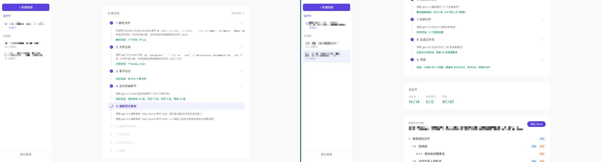
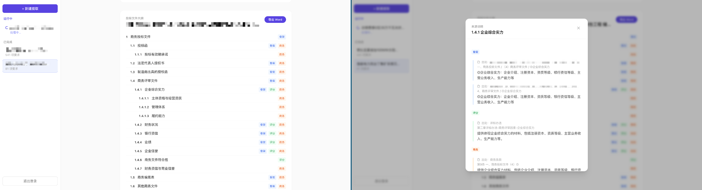

# Bid Copilot

Reads a tender document (招标文件) and automatically generates a structured **bid-document outline** (投标文件大纲) — the chapter tree a bidder must produce to respond, traced back to where each requirement came from in the tender. Built as a demo on Azure OpenAI. Upload a tender (single file or a package of files), watch a 9-step pipeline run live, review the outline with per-node source traceability and a coverage report, then export to Word.




## How it works

A 9-step pipeline (`src/bid_copilot/understanding/pipeline.py`) turns raw files into the outline:

1. **parse** — `.docx` parsed locally (native heading levels preserved); `.doc` / `.pdf` go through Azure Content Understanding for structured markdown.
2. **classify** — label each file (tender body / scoring / tech spec / commercial …).
3. **segment** — split documents into chapter blocks.
4. **locate** — find the key sections (bid-format, scoring, tech-spec, commercial).
5. **extract_skeleton** — pull the explicit bid-document skeleton the tender prescribes.
6. **extract_requirements** — extract response requirements. Scoring/commercial items are extracted one-by-one; technical *parameter-level* indicators are aggregated into a single "technical parameter response" entry (a bidder answers them in one response table, not as separate outline chapters), while requirements that need their own narrative / supporting material / dedicated section stay individual.
7. **merge** — normalize and de-duplicate the skeleton, then attach requirements to nodes. `ref_id`s are back-filled by engineering code, not by the LLM.
8. **supplement** — place any requirement that wasn't attached during merge (the LLM only decides *where*; `ref_id` back-fill is again engineering).
9. **finalize** — renumber the tree and compute the coverage report from the tree's `ref_id`s.

The web UI streams step progress over SSE, renders the outline with clickable source badges, shows a coverage panel, and exports Word.

## Quick Start

### Docker

1）Generate a strong random token (optional, used as LOCAL_AUTH_PASSWORD)

```bash
openssl rand -hex 32
```

2）Start the container

```bash
docker run -itd -p 8080:8080 --name BidCopilot \
  --restart unless-stopped \
  -e FOUNDRY_CU_BASE_URL=https://<foundry-resource>.cognitiveservices.azure.com \
  -e FOUNDRY_CU_API_KEY=your-content-understanding-api-key \
  -e FOUNDRY_AOAI_BASE_URL=https://<foundry-resource>.openai.azure.com/openai/v1 \
  -e FOUNDRY_AOAI_API_KEY=your-foundry-api-key \
  -e LOCAL_AUTH_USERNAME=demo \
  -e LOCAL_AUTH_PASSWORD=your-strong-random-token \
  ghcr.io/heyjiqingcode/bidcopilot:1.0.0
```

> See [Configuration](#configuration) for every available variable.

### Local

1）Set up

```bash
# Clone code and install requirements
git clone https://github.com/HeyJiqingCode/BidCopilot.git
cd BidCopilot
python -m venv .venv
pip install -r requirements.txt

# Copy .env.example and fill in your Azure OpenAI / Foundry settings
cp .env.example .env
```

2）Run the server from source

```bash
# run the web app
ENABLE_LOCAL_AUTH=false PYTHONPATH=src .venv/bin/uvicorn bid_copilot.api.main:app --port 8080

# open http://127.0.0.1:8080
```

> See [Configuration](#configuration) for every available variable.

## Configuration

| Variable | Purpose | Default |
|---|---|---|
| `FOUNDRY_AOAI_API_KEY` | Azure OpenAI API key | |
| `FOUNDRY_AOAI_BASE_URL` | Azure OpenAI v1 endpoint (ends with `/openai/v1/`) | |
| `FOUNDRY_CU_BASE_URL` | Azure Content Understanding endpoint (optional; needed for `.doc`/scanned PDF) | |
| `FOUNDRY_CU_API_KEY` | Azure Content Understanding API key (optional) | |
| `MODEL_MAIN` | main model deployment name | `gpt-5.4` |
| `MODEL_MINI` | mini model deployment name | `gpt-5.4-mini` |
| `MODEL_NANO` | nano model deployment name | `gpt-5.4-nano` |
| `MODEL_CLASSIFY` | model tier for **classify** (`main`/`mini`/`nano`) | `mini` |
| `MODEL_LOCATE` | model tier for **locate** | `main` |
| `MODEL_SKELETON` | model tier for **extract_skeleton** | `main` |
| `MODEL_REQUIREMENTS` | model tier for **extract_requirements** | `main` |
| `MODEL_MERGE` | model tier for **merge** | `main` |
| `MODEL_SUPPLEMENT` | model tier for **supplement** | `main` |
| `EFFORT_CLASSIFY` | reasoning effort for **classify** (`low`/`medium`/`high`) | `low` |
| `EFFORT_LOCATE` | reasoning effort for **locate** | `medium` |
| `EFFORT_SKELETON` | reasoning effort for **extract_skeleton** | `medium` |
| `EFFORT_REQUIREMENTS` | reasoning effort for **extract_requirements** | `medium` |
| `EFFORT_MERGE` | reasoning effort for **merge** | `high` |
| `EFFORT_SUPPLEMENT` | reasoning effort for **supplement** | `high` |
| `ENABLE_LOCAL_AUTH` | enable the local login gate (`true`/`false`) | `false` |
| `LOCAL_AUTH_USERNAME` | local login username | `admin` |
| `LOCAL_AUTH_PASSWORD` | local login password | `admin123` |
| `LOCAL_AUTH_SESSION_HOURS` | login session lifetime in hours | `24` |
| `LOCAL_AUTH_COOKIE_NAME` | login session cookie name | `bid_copilot_session` |
| `MAX_CONCURRENCY` | parallelism cap for per-chapter extraction and merge batching | `5` |

> **Per-step model tiers** let you trade speed for accuracy. The accuracy-critical steps — `extract_requirements`, `merge`, `supplement` — should stay on `main`; lighter steps (`classify`, `locate`, `skeleton`) can drop to `mini`/`nano`.